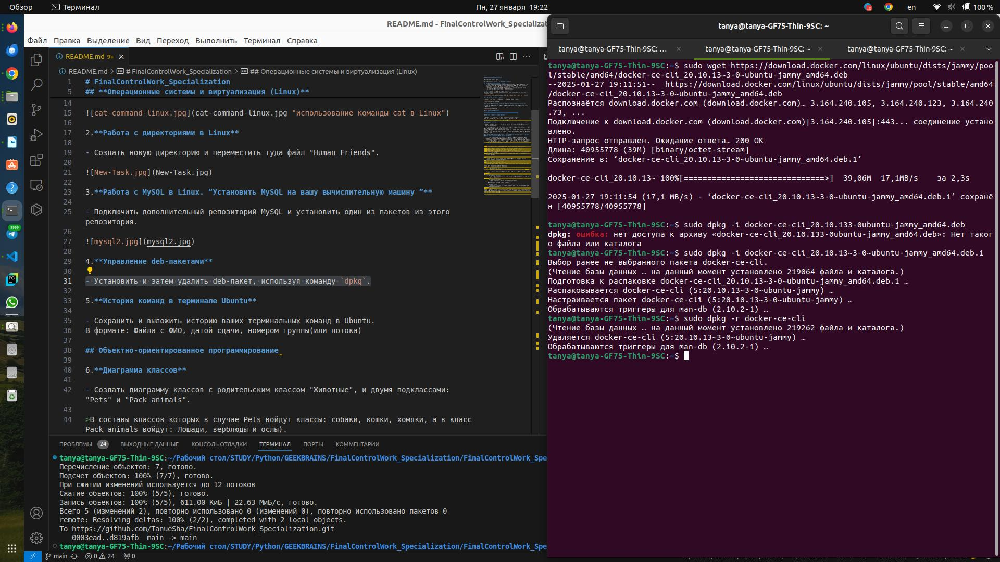

# FinalControlWork_Specialization

Итоговая контрольная работа

## **Операционные системы и виртуализация (Linux)**

1. **Использование команды cat в Linux**
   - Создать два текстовых файла: "Pets"(Домашние животные) и "Pack animals"(вьючные животные), используя команду `cat` в терминале Linux. В первом файле перечислить собак, кошек и хомяков. Во втором — лошадей, верблюдов и ослов.
   - Объединить содержимое этих двух файлов в один и просмотреть его содержимое.
   - Переименовать получившийся файл в "Human Friends"(.

>Пример конечного вывода после команды “ls” :
Desktop Documents Downloads  HumanFriends.txt  Music  PackAnimals.txt  Pets.txt  Pictures  Videos


2.**Работа с директориями в Linux**

- Создать новую директорию и переместить туда файл "Human Friends".


3.**Работа с MySQL в Linux. “Установить MySQL на вашу вычислительную машину ”**

- Подключить дополнительный репозиторий MySQL и установить один из пакетов из этого репозитория.


4.**Управление deb-пакетами**

- Установить и затем удалить deb-пакет, используя команду `dpkg`.



5.**История команд в терминале Ubuntu**

- Сохранить и выложить [историю ваших терминальных команд](HISTORY-COMMAND.md) в Ubuntu.

## Объектно-ориентированное программирование

6.**Диаграмма классов**

- Создать диаграмму классов с родительским классом "Животные", и двумя подклассами: "Pets" и "Pack animals".

>В составы классов которых в случае Pets войдут классы: собаки, кошки, хомяки, а в класс Pack animals войдут: Лошади, верблюды и ослы).
Каждый тип животных будет характеризоваться (например, имена, даты рождения, выполняемые команды и т.д)
Диаграмму можно нарисовать в любом редакторе, такими как Lucidchart, Draw.io, Microsoft Visio и других.


7.**Работа с MySQL (Задача выполняется в случае успешного выполнения задачи “Работа с MySQL в Linux. “Установить MySQL на вашу машину”)**

   7.1. После создания диаграммы классов в 6 пункте, в 7 пункте база данных "Human Friends" должна быть структурирована в соответствии с этой диаграммой. Например, можно создать таблицы, которые будут соответствовать классам "Pets" и "Pack animals", и в этих таблицах будут поля, которые характеризуют каждый тип животных (например, имена, даты рождения, выполняемые команды и т.д.). 

   7.2

   - В ранее подключенном MySQL создать базу данных с названием ["Human Friends"](Human_friends.sql).

   - Создать таблицы, соответствующие иерархии из вашей диаграммы классов.
   - Заполнить таблицы данными о животных, их командах и датами рождения.
   - Удалить записи о верблюдах и объединить таблицы лошадей и ослов.
   - Создать новую таблицу для животных в возрасте от 1 до 3 лет и вычислить их возраст с точностью до месяца.
   - Объединить все созданные таблицы в одну, сохраняя информацию о принадлежности к исходным таблицам.

```
-- 1. Создание базы данных
CREATE DATABASE IF NOT EXISTS `Human_Friends`;
USE `Human_Friends`;

-- 2. Создание таблиц для домашних животных (Pets)
CREATE TABLE Pets (
    id INT AUTO_INCREMENT PRIMARY KEY,
    name VARCHAR(50),
    birth_date DATE,
    type ENUM('Dog', 'Cat', 'Hamster'),
    commands TEXT
);

-- 3. Создание таблиц для вьючных животных (Pack_Animals)
CREATE TABLE Pack_Animals (
    id INT AUTO_INCREMENT PRIMARY KEY,
    name VARCHAR(50),
    birth_date DATE,
    type ENUM('Horse', 'Camel', 'Donkey'),
    commands TEXT
);

-- 4. Заполнение таблиц данными
INSERT INTO Pets (name, birth_date, type, commands) VALUES
('Барсик', '2022-03-15', 'Cat', 'Сидеть'),
('Шарик', '2021-06-10', 'Dog', 'Голос, Лежать'),
('Пушистик', '2023-01-20', 'Hamster', 'Бегать по кругу');

INSERT INTO Pack_Animals (name, birth_date, type, commands) VALUES
('Буцефал', '2020-05-02', 'Horse', 'Бег, Прыжок'),
('Гоби', '2019-08-30', 'Camel', 'Идти'),
('Иа', '2021-02-11', 'Donkey', 'Нести груз');

-- 5. Удаление записей о верблюдах
DELETE FROM Pack_Animals WHERE type = 'Camel';

-- 6. Объединение таблиц лошадей и ослов в одну
CREATE TABLE Horses_Donkeys AS
SELECT * FROM Pack_Animals WHERE type IN ('Horse', 'Donkey');

-- 7. Создание новой таблицы для животных 1-3 лет и расчет их возраста
CREATE TABLE Young_Animals AS
SELECT id, name, birth_date, type, TIMESTAMPDIFF(MONTH, birth_date, CURDATE()) AS age_months 
FROM (
    SELECT * FROM Pets
    UNION ALL
    SELECT * FROM Horses_Donkeys
) AS all_animals
WHERE TIMESTAMPDIFF(YEAR, birth_date, CURDATE()) BETWEEN 1 AND 3;

-- 8. Объединение всех таблиц в одну с указанием источника
CREATE TABLE All_Animals AS
SELECT id, name, birth_date, type, commands, 'Pets' AS source FROM Pets
UNION ALL
SELECT id, name, birth_date, type, commands, 'Horses_Donkeys' AS source FROM Horses_Donkeys;

```


8. **ООП и Java**
   - Создать иерархию классов в Java, который будет повторять диаграмму классов созданную в задаче 6(Диаграмма классов).
   

9. **Программа-реестр домашних животных**
    - Написать программу на Java, которая будет имитировать реестр домашних животных. 
    

Должен быть реализован следующий функционал:
    
   9.1. Добавление нового животного
        - Реализовать функциональность для добавления новых животных в реестр.       

   Животное должно определяться в правильный класс (например, "собака", "кошка", "хомяк" и т.д.)
        
 
   9.2. Список команд животного
        - Вывести список команд, которые может выполнять добавленное животное (например, "сидеть", "лежать").
        
   9.3. Обучение новым командам
        - Добавить возможность обучать животных новым командам.

   9.4 Вывести список животных по дате рождения

   9.5. Навигация по меню
        - Реализовать консольный пользовательский интерфейс с меню для навигации между вышеуказанными функциями.
        
10. **Счетчик животных**
Создать механизм, который позволяет вывести на экран общее количество созданных животных любого типа (Как домашних, так и вьючных), то есть при создании каждого нового животного счетчик увеличивается на “1”. 
  
